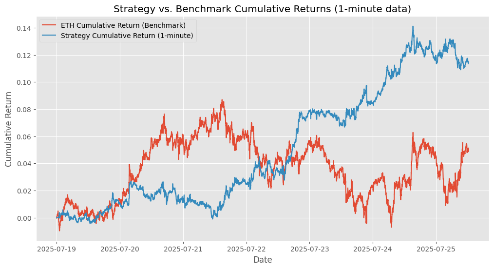

# 📈 Cryptocurrency Trading Strategy: BTC-ETH Lag, Correlation & BTC Candle Percentage Change

This notebook explores the development and backtesting of **two short-term Ethereum (ETH) trading strategies** based on **Bitcoin (BTC) price movements**, using historical data from Yahoo Finance via `yfinance` `kaggle`.

---
## 📊 Strategy Performance Example

This graph shows the performance of the strategy:



---

## 🧠 Strategies Explored

### 1. ⚖️ BTC-ETH Lag and Correlation Strategy

This strategy attempts to capture a potential **lagged relationship between Bitcoin and Ethereum** prices. It includes:
- Identifying the optimal lag with the highest correlation.
- Generating trading signals based on the **ETH/BTC price ratio**.
- Using a **dynamic correlation filter** and time-based exits with optional stop-losses.

### 2. 📊 BTC Candle Percentage Change Strategy

This strategy trades ETH when **BTC shows a significant candle move** (up/down) within a 15-minute interval:
- Entry: Triggered when BTC price changes exceed a defined percentage threshold.
- Exit: After a fixed time duration.
- Includes optimization of the **candle size threshold** and optional **stop-loss** handling.

---

## 📚 Notebook Structure

### 🔧 Setup
- Installs and imports required libraries:
  - `yfinance`, `pandas`, `numpy`, `matplotlib`, `seaborn`

---

### 📉 BTC-ETH Lag and Correlation Strategy (Hourly)
- Load 1-hour BTC & ETH data.
- Calculate lag and correlation to find optimal delay.
- Strategy logic:
  - Trade based on **ETH/BTC ratio**.
  - Apply **moving average crossover** and **correlation threshold**.
- Backtest with performance metrics:
  - Total Return
  - Annualized Return
  - Volatility
  - Sharpe Ratio
- Refine strategy with:
  - Dynamic correlation in loop
  - Stop-loss mechanism
- Visualize results and summarize insights.

---

### 🕐 BTC-ETH Lag Strategy (1-Minute & 15-Minute)
- Load BTC/ETH for:
  - 1-minute interval (7 days)
  - 15-minute interval (60 days)
- Calculate lagged correlation for each timeframe.
- Build and backtest simplified strategies for both.
- Compare ETH benchmark vs strategy performance.

---

### 📈 BTC Candle Percentage Change Strategy (15-Minute)
- Load 15-min BTC & ETH data.
- Define % thresholds for BTC candle size.
- Backtest strategy across thresholds:
  - Entry on large BTC candle
  - Exit after 1 interval
- Optimize based on:
  - Total Return
  - Sharpe Ratio
  - Max Drawdown
- Implement refined version with:
  - Best-performing threshold (0.10%)
  - Stop-loss handling
- Compare to ETH buy & hold.

---

### 💹 Nasdaq Benchmark Strategy
- Load BTC, ETH, and **Nasdaq Composite (^IXIC)** data (15-min).
- Strategy:
  - Entry: BTC 30-min price move
  - Exit: Fixed 15-min duration
- Backtest against both ETH and Nasdaq.
- Include Alpha (relative performance) calculation.
- Add stop-loss and risk controls.
- Final comparison of:
  - Absolute return
  - Sharpe Ratio
  - Benchmark Alpha

---

## 📌 Key Findings & Insights

- **Initial lag/correlation strategy** underperformed ETH benchmark.
- **Dynamic correlation + stop-loss** improved risk-adjusted returns.
- 1-minute version showed some promise; 15-minute version struggled.
- **BTC Candle % Change Strategy**:
  - Highly sensitive to threshold.
  - Optimal threshold (0.10%) achieved Sharpe Ratio ≈ **1.97**.
  - Stop-loss further improved returns.


---

## 🔮 Potential Next Steps

- **Parameter Optimization**: Fine-tune thresholds, durations, windows.
- **New Signals & Exits**: Try RSI, Bollinger Bands, dynamic exits.
- **Risk Management**: Add volatility-based sizing, max drawdown limits.
- **Transaction Costs**: Add slippage and fee modeling.
- **Out-of-Sample Testing**: Prevent overfitting, improve robustness.
- **Market Regimes**: Study bull vs. bear market impact on strategy.

---

## 📦 Requirements
I have attached a `requirements.txt` file.

- Python 3.6+
- [`yfinance`](https://pypi.org/project/yfinance/)
- `pandas`
- `numpy`
- `matplotlib`
- `seaborn`

### ✅ Install Dependencies:

```bash
pip install requirements.txt
